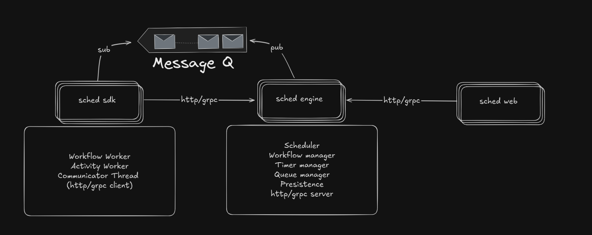

# sched

Durable workflow orchestration in Go. Write workflows as plain functions and the engine takes care of persistence, retries, signals, timers, and replay across restart and worker failure.

```go
client.RegisterWorkflow("MonthlyReport", func(ctx sdk.WorkflowContext, _ any) (any, error) {
    ctx.QueueActivity("LoadRows", "users")
    ctx.Sleep(24 * time.Hour)
    ctx.QueueActivity("Mail", "report-ready")
    return "queued", nil
})
```

Inspired by Temporal and Cadence. Single Go SDK, single binary, Postgres plus Redis. Apache 2.0.

> Status: **alpha**, in active development toward `v0.1.0`. The architecture
> described in [`docs/PRD.md`](docs/PRD.md) is partially shipped; see the
> [capability table](#capabilities) below for what is real today.

## Why

- **State survives anything.** Every workflow transition is persisted to Postgres before the RPC returns. Engine restart, worker crash, network blip — the workflow resumes.
- **Replay on yield.** Workflow functions are deterministic over their event history. When a worker dies the engine re-dispatches the task; the function re-runs against the same history with recorded commands turned into no-ops. This is the standard Temporal-style model, minus the platform.
- **One binary to operate.** No coordinator, no sidecar. Active-passive HA is a Postgres advisory lock. Observability is a `/metrics` endpoint and an OTLP exporter.

## Capabilities

| Capability                                    | State    |
| --------------------------------------------- | -------- |
| Workflow + activity execution                 | shipped  |
| Postgres-backed durable state (event-sourced) | shipped  |
| Distributed task queue on Redis Streams       | shipped  |
| Durable timers (`Sleep`) survive worker crash | shipped  |
| Activity retries with exponential backoff     | shipped  |
| Signals + `WaitForSignal` with crash recovery | shipped  |
| Activity heartbeats + cancellation            | shipped  |
| Workflow cancellation + execution timeout     | shipped  |
| Bidi-streamed task dispatch (gRPC streams)    | shipped  |
| Active-passive HA via Postgres advisory lock  | shipped  |
| Structured logs (slog), Prometheus, OpenTelemetry | shipped |
| Web dashboard + landing site (React 19, Tailwind v4) | shipped |
| `golangci-lint` + GitHub Actions CI           | shipped  |
| Workflow queries (`QueryWorkflow`)            | planned  |
| Activity start-to-close timeouts              | planned  |
| Multi-active sharded engine                   | planned  |

## Architecture



Three logical roles, deployable as one binary today:

- **Engine** — public gRPC API, owns workflow state, writes history to Postgres, dispatches tasks via Redis Streams, exposes `/metrics`.
- **Worker** — runs your code. Opens a bidi gRPC stream to the engine, executes workflow and activity tasks, acks completion.
- **Dashboard** — React SPA embedded in a Go binary that reads through the engine's gRPC API.

## Quickstart

Requires Docker and Docker Compose. Go 1.25+ and `pnpm` only needed for local development.

```bash
git clone https://github.com/edaywalid/sched.git
cd sched
make up
```

`make up` brings up Postgres, Redis, runs migrations, then starts the engine, a worker, and the dashboard. Open `http://localhost:8080`.

To run a demo workflow on boot, set `AUTO_START_TEST=true` on the worker service.

### Running without Docker

```bash
make deps                          # tidy + generate
make proto                         # protobuf
make migrate-up                    # apply schema (needs SCHED_POSTGRES_DSN)
make run-engine                    # in one terminal
make run-worker                    # in another
make web-dev                       # dashboard SPA (Vite, port 5173)
```

Leave `SCHED_POSTGRES_DSN` unset to fall back to an in-memory store. Useful for unit experiments; state is lost on restart.

## Writing workflows

A workflow is a Go function. Inside it the SDK exposes a few durable primitives.

```go
client.RegisterWorkflow("ApprovalGate", func(ctx sdk.WorkflowContext, input any) (any, error) {
    name, payload, err := ctx.WaitForSignal(24 * time.Hour)
    if err != nil {
        return nil, err
    }
    if name != "approve" {
        return "rejected", nil
    }
    ctx.QueueActivity("Process", payload)
    return "approved", nil
})
```

Activities are plain functions too:

```go
client.RegisterActivity("Process", func(ctx sdk.ActivityContext, input any) (any, error) {
    ctx.Heartbeat(nil)
    return doWork(input), nil
})
```

Retries follow the engine's default `RetryPolicy`. Per-activity policy
overrides are planned ([roadmap](#roadmap)).

Start one over gRPC or the dashboard:

```bash
curl -X POST http://localhost:8080/api/workflows \
  -H 'Content-Type: application/json' \
  -d '{"workflowName":"ApprovalGate","input":"req-42"}'
```

## Operating

### High availability

Run multiple engine processes against the same Postgres + Redis. Each instance tries to acquire a Postgres advisory lock; whichever holds it is the leader. Standbys idle. Loss of the leader releases the lock; a standby promotes within the retry interval.

```yaml
services:
  engine-1:
    image: sched-engine
    environment:
      SCHED_POSTGRES_DSN: postgres://...
      SCHED_LEADER_LOCK_KEY: "6005075820067160625"
  engine-2:
    image: sched-engine
    environment:
      SCHED_POSTGRES_DSN: postgres://...
      SCHED_LEADER_LOCK_KEY: "6005075820067160625"
```

True multi-active sharded ownership is on the roadmap.

### Observability

- **Logs**: structured slog. Default text, set `SCHED_LOG_FORMAT=json` for JSON. Level via `SCHED_LOG_LEVEL=debug|info|warn|error`.
- **Metrics**: Prometheus exposition on `:${SCHED_METRICS_PORT:-9090}/metrics`. Counters for workflows started/completed by status, activities executed by status, queue poll latency, activity duration.
- **Tracing**: OpenTelemetry OTLP/gRPC. Set `SCHED_OTLP_ENDPOINT=otel-collector:4317` and `SCHED_OTEL_SERVICE_NAME=sched-engine`. `docker compose --profile tracing up` brings Jaeger up on `:16686` for a quick look.

### Streaming dispatch

Workers can opt in to bidi-streamed task delivery instead of long-polling by setting `SCHED_WORKER_STREAMING=true`. The engine exposes `StreamWorkflowTasks` and `StreamActivityTasks`; the worker opens both streams in parallel.

### Graceful shutdown

The engine cancels in-flight polls and drains streams on SIGTERM. Bump the grace period with `SCHED_SHUTDOWN_GRACE_SECONDS` (default `8`).

## Configuration

All flags are environment variables.

| Variable                          | Component  | Default              | Purpose                                          |
| --------------------------------- | ---------- | -------------------- | ------------------------------------------------ |
| `ENGINE_PORT`                     | engine     | `50051`              | gRPC listen port                                 |
| `SCHED_POSTGRES_DSN`              | engine     | _(in-memory)_        | Postgres DSN; leave unset for ephemeral mode     |
| `SCHED_LEADER_LOCK_KEY`           | engine     | `0x53636845644c6431` | Postgres advisory lock key for leader election   |
| `SCHED_METRICS_PORT`              | engine     | `9090`               | Prometheus listen port                           |
| `SCHED_LOG_LEVEL`                 | all        | `info`               | `debug`, `info`, `warn`, `error`                 |
| `SCHED_LOG_FORMAT`                | all        | `text`               | `text` or `json`                                 |
| `SCHED_OTLP_ENDPOINT`             | all        | _(unset, no traces)_ | OTLP/gRPC collector endpoint                     |
| `SCHED_OTEL_SERVICE_NAME`         | all        | per-binary           | Service name in traces                           |
| `SCHED_SHUTDOWN_GRACE_SECONDS`    | engine     | `8`                  | Grace period on SIGTERM                          |
| `ENGINE_ADDRESS`                  | worker, dashboard | `localhost:50051` | gRPC address of the engine                  |
| `TASK_QUEUE`                      | worker     | `default`            | Task queue name to poll                          |
| `SCHED_WORKER_STREAMING`          | worker     | `false`              | Opt in to bidi-streamed task dispatch            |
| `AUTO_START_TEST`                 | worker     | `false`              | Demo mode: register and start test workflows     |
| `DASHBOARD_PORT`                  | dashboard  | `8080`               | HTTP port                                        |

## Project layout

```
cmd/
  engine/        # gRPC server binary
  sdk/           # demo worker binary; consumes the SDK
  dashboard/     # embeds the React SPA, proxies to the engine
engine/          # core orchestrator (workflow + activity + timer logic)
sdk/             # Go SDK consumed by workers
queue/           # Redis Streams task queue
proto/           # gRPC contract
internal/store/  # sqlc-generated persistence layer
migrations/      # golang-migrate up/down SQL
web/
  apps/dashboard # React SPA embedded in cmd/dashboard
  apps/site      # TanStack Start landing + docs + blog (host yourself)
  packages/design # shared design tokens, fonts, Logo, Motion helpers
docs/PRD.md      # north-star design doc; partially implemented
```

## Development

```bash
make deps          # go mod tidy + go generate
make proto         # regenerate gRPC stubs
make sqlc-gen      # regenerate Postgres queries
make migrate-new NAME=add_shards
make test          # unit + integration (needs Postgres + Redis)
make lint          # golangci-lint
make web-dev       # dashboard dev server (port 5173)
make site-dev      # landing + docs dev server (port 3000)
make web-build     # production SPA bundle into web_dist
```

CI runs `go build`, `go vet`, `go test -race`, and `golangci-lint` against Postgres 16 and Redis 7 services on every push and PR.

## Roadmap

Tracked in [`docs/PRD.md`](docs/PRD.md). The immediate runway:

- Workflow queries (`QueryWorkflow` RPC, replay-mode read)
- Activity start-to-close timeouts
- Multi-active sharded engine (advisory lock per shard)
- Docs site content + a first blog post
- `v0.1.0` release

## License

Apache License 2.0. See [LICENSE](LICENSE).
